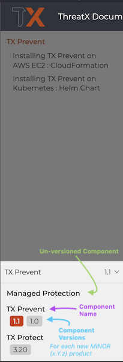

# TX Prevent Documentation Component
This repository contains the source material for TX Prevent documentation.

This and other Asciidoc sources are compiled into a static site using Antora and published at [docs.threatx.com/txprevent](https://docs.threatx.com/txprevent/1.0/index.html) by a workflow of the [ThreatX/docs.threatx.com](https://github.com/ThreatX/docs.threatx.com.git) repository.

## Conventions

### Versioning 
Component versions are structured as `X.Y` where `X` is the product major version and `Y` is the product minor version.

A directory containing an `antora.yml` file will be treated as a documentation __components__. (`docs/antora.yml` in this project). The component name and __component version__ are defined here.  

The image below shows the component version selector on [docs.threatx.com](https://docs.threatx.com):  

### Branch Naming
A branch exists for each component version, named after said version. This is for organizational purposes and is not considered by the site generator. 

## Processes

### Creating a new version

1. Create a branch from the __previous component version__. For example, to create version 1.1, create a branch from the 1.0 branch.
2. Update the `version` field in [docs/antora.yml](./docs/antora.yml) to the new version, e.g. `version: 1.1`
3. Commit the change and push to remote.

## Development 

### New Documention Component

**Note:** Before working through the installation steps, make sure that you have both `node` and `npm` installed.  

To use the component template in your project:
- Clone the project locally.
- Install necessary dependencies by running `npm i`.
- Update `docs/antora.yml`, changing the `name`, `title`, and `version` properties making them appropriate to your project.
- Start adding content under `modules/ROOT/pages`.
  An empty default file (`modules/ROOT/pages/index.adoc`) is available, ready for adding initial content.

## Command-Line Tooling

### Linters

The `package.json` provides linters ( `yamllint` for YAML and `vale` for AsciiDoc source files) and NPM scripts for use.

Yamllint is used to check for correct syntax in the `antora.yml` file.

Vale checks things like spelling, readability and style guide compliance.
It is configured with the `.vale.ini` file.

#### Install Dependencies
Yamllint will be installed on the first run `npm i`.

Vale requires styles to be downloaded. To install vale styles:

    `npm run sync-styles`.

#### Usage

NPM scripts are provided for each of the main targets for linting: `docs/antora.yml` and all AsciiDoc (`*.adoc`) files under (`docs/`).

To lint the `antora.yml`:

     `npm run check-yaml`.

To lint all AsciiDoc files: 

    `npm run check-style`

